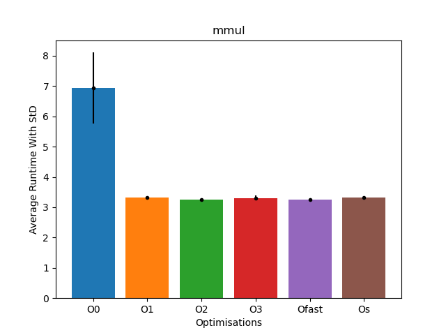
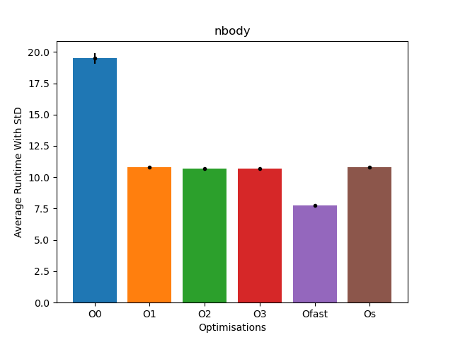
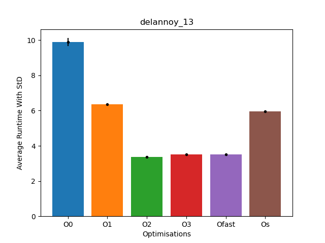
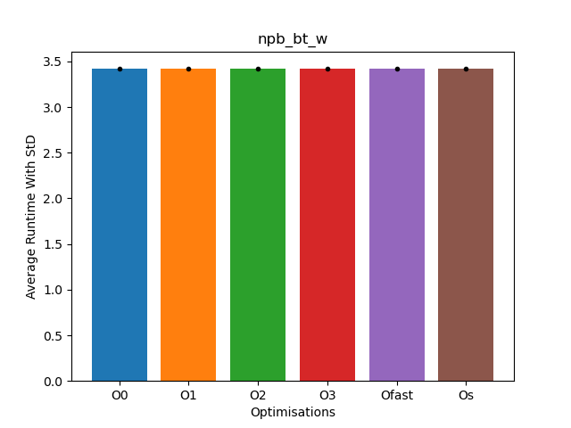
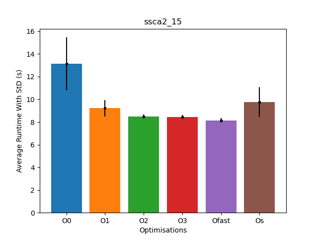

The `CMakeLists.txt` of `./small_samples` as well as `./larger_samples/npb_bt` and `./larger_samples/ssca2`
were modified to build all optimization levels as separate binaries.

To build, copy the respective files into the source folders of `perf-oriented-dev` and run the following commands:

```bash
mkdir build
cd build
cmake .. -G Ninja
ninja
```

## A)

The `benchmarking-python/benchmarking_a.py` file will run all required programs **5** times and store the results in a `JSON` file.
>[!NOTE]
>The script will also create `.sh` and `.out` files run `rm *.out *.sh` to remove these files.
>The json files need to be moved into a `data` folder for the plotting script to pick them up.
>```bash
>   mkdir data && mv *.json data
>```

To generate all plots run:
```bash
for program in "mmul" "nbody" "qap_chr15c" "delannoy_13" "npb_bt_w" "ssca2_15"
do
    python plotting_a.py $program
done
```

### Findings
For `mmul`, `qap` and `npb` the only significant optimization was from moving from no optimization to any optimization.
The average runtimes appear to be consistent after this first optimization level.

For `nbody` the `-Ofast` optimization performed the best which makes sense as a lot of simulation is performed in this application.

For `delannoy` we can see that `-Os` has a significant negative impact on runtime which is not the case for the other applications.
This is also the only application where `-O1` performs significantly worse that the following optimization levels.

For `ssca2` we can see that overall the optimizations have had the least impact on performance.
Given the fact that this program is operating on a graph and thereby bound by memory access,
runtime optimizations will not have that big of an impact.

Overall no significant differences between `-O2` and `-O3` can be seen, which I find a bit surprising...









## B)
```bash
gcc -Q --help=optimizers -O2 | grep enabled > O2.txt
gcc -Q --help=optimizers -O3 | grep enabled > O3.txt
diff O2.txt O3.txt
```

This will result in the following output:

    28a29
    >   -fgcse-after-reload         		[enabled]
    41a43
    >   -fipa-cp-clone              		[enabled]
    61a64,65
    >   -floop-interchange          		[enabled]
    >   -floop-unroll-and-jam       		[enabled]
    69a74
    >   -fpeel-loops                		[enabled]
    72a78
    >   -fpredictive-commoning      		[enabled]
    96a103,104
    >   -fsplit-loops               		[enabled]
    >   -fsplit-paths               		[enabled]
    117a126
    >   -ftree-loop-distribution    		[enabled]
    121a131
    >   -ftree-partial-pre          		[enabled]
    134a145,146
    >   -funroll-completely-grow-size 	[enabled]
    >   -funswitch-loops            		[enabled]
    135a148
    >   -fversion-loops-for-strides 		[enabled]


> `-fversion-loops-for-strides` throws a compilation error for `npb_bt`.
