The `CMakeLists.txt` of `./small_samples` as well as `./larger_samples/npb_bt` and `./larger_samples/ssca2`
were modified to build all optimization levels as separate binaries.

To build, copy the respective files into the source folders of `perf-oriented-dev` and run the following commands:

```bash
mkdir build
cd build
cmake .. -G Ninja
ninja
```

## A)

The `benchmarking-python/benchmarking_a.py` file will run all required programs **5** times and store the results in a `JSON` file.
>[!NOTE]
>The script will also create `.sh` and `.out` files run `rm *.out *.sh` to remove these files.
>The json files need to be moved into a `data` folder for the plotting script to pick them up.
>```bash
>   mkdir data && mv *.json data
>```

To generate all plots run:
```bash
for program in "mmul" "nbody" "qap_chr15c" "delannoy_13" "npb_bt_w" "ssca2_15"
do
    python plotting_a.py $program
done
```

### Findings
For `mmul`, `qap` and `npb` the only significant optimization was from moving from no optimization to any optimization.
The average runtimes appear to be consistent after this first optimization level.

For `nbody` the `-Ofast` optimization performed the best which makes sense as a lot of simulation is performed in this application.

For `delannoy` we can see that `-Os` has a significant negative impact on runtime which is not the case for the other applications.
This is also the only application where `-O1` performs significantly worse that the following optimization levels.

For `ssca2` we can see that overall the optimizations have had the least impact on performance.
Given the fact that this program is operating on a graph and thereby bound by memory access,
runtime optimizations will not have that big of an impact.

Overall no significant differences between `-O2` and `-O3` can be seen, which I find a bit surprising...

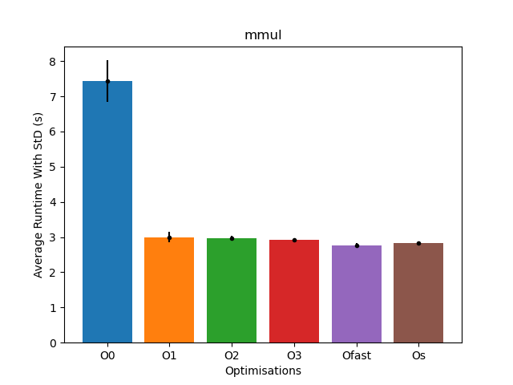
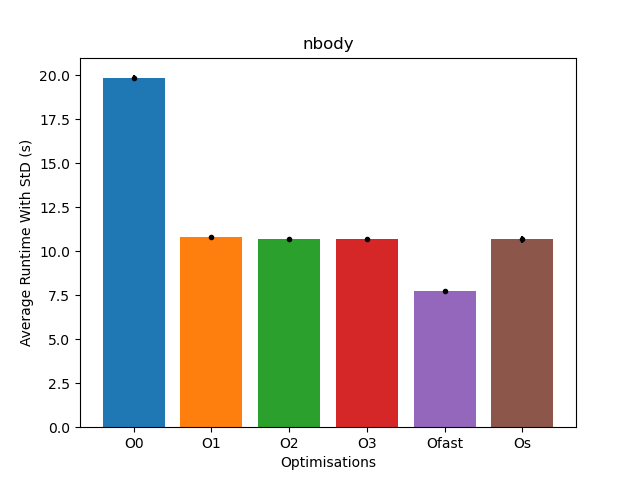
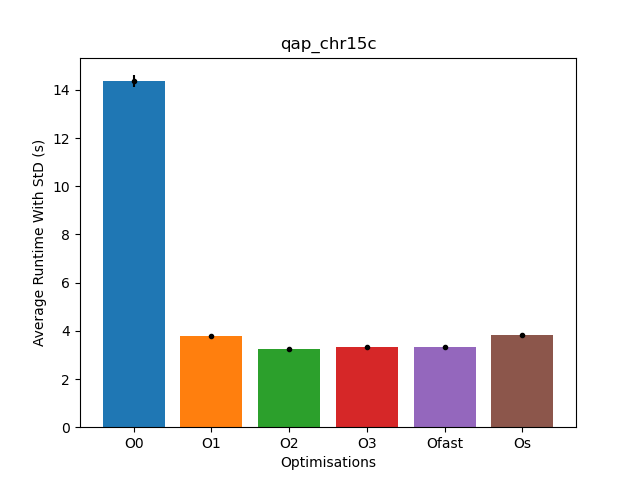

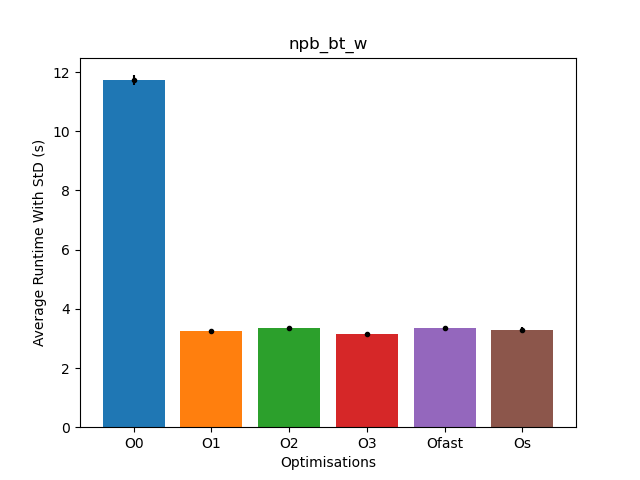
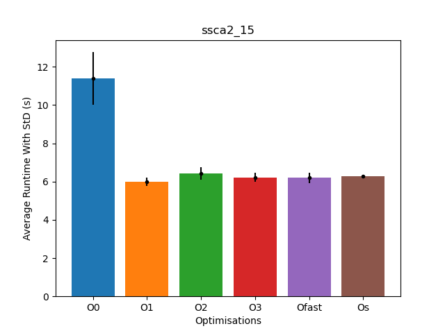


## B)
```bash
gcc -Q --help=optimizers -O2 | grep enabled > O2.txt
gcc -Q --help=optimizers -O3 | grep enabled > O3.txt
diff O2.txt O3.txt
```

This will result in the following output:

    28a29
    >   -fgcse-after-reload         		[enabled]
    41a43
    >   -fipa-cp-clone              		[enabled]
    61a64,65
    >   -floop-interchange          		[enabled]
    >   -floop-unroll-and-jam       		[enabled]
    69a74
    >   -fpeel-loops                		[enabled]
    72a78
    >   -fpredictive-commoning      		[enabled]
    96a103,104
    >   -fsplit-loops               		[enabled]
    >   -fsplit-paths               		[enabled]
    117a126
    >   -ftree-loop-distribution    		[enabled]
    121a131
    >   -ftree-partial-pre          		[enabled]
    134a145,146
    >   -funroll-completely-grow-size 	[enabled]
    >   -funswitch-loops            		[enabled]
    135a148
    >   -fversion-loops-for-strides 		[enabled]

> [!NOTE]
> `-fversion-loops-for-strides` throws a compilation error for `npb_bt`.
> `-funroll-completely-grow-size` also threw an error.

`plotting_b.py` plots the average runtimes an prints the best performing command to std out
as well as the 3 best performing flags based on a penalty score.

flag with lowest average runtime:

mmul: unswitch-loops
nbody: gcse-after-reload
qap: loop-interchange
delannoy: unswitch-loops 13
npb_bt_w: peel-loops
ssca2: unswitch-loops

Ranking for best performing overall:
This was acquired by adding up the `position` in the sorted list of average runtimes.

{'gcse-after-reload': 25, 'ipa-cp-clone': 42, 'loop-interchange': 29, 'loop-unroll-and-jam': 36, 'peel-loops': 25, 'predictive-commoning': 28, 'split-loops': 35, 'split-paths': 34, 'tree-loop-distribution': 21, 'tree-partial-pre': 28, 'unswitch-loops': 27}

\['tree-loop-distribution', 'gcse-after-reload', 'peel-loops'\]

explanations from 

### `tree-loop-distribution`
Perform loop distribution. This flag can improve cache performance on big loop bodies and allow further loop optimizations, like parallelization or vectorization, to take place. For example, the loop

DO I = 1, N
  A(I) = B(I) + C
  D(I) = E(I) * F
ENDDO

is transformed to

DO I = 1, N
   A(I) = B(I) + C
ENDDO
DO I = 1, N
   D(I) = E(I) * F
ENDDO

### gcse-after-reload
When -fgcse-after-reload is enabled, a redundant load elimination pass is performed after reload. The purpose of this pass is to clean up redundant spilling.

### `peel-loops`
Peels loops for which there is enough information that they do not roll much (from profile feedback or static analysis). It also turns on complete loop peeling (i.e. complete removal of loops with small constant number of iterations).

### `unswitch-loops`
Move branches with loop invariant conditions out of the loop, with duplicates of the loop on both branches (modified according to result of the condition).

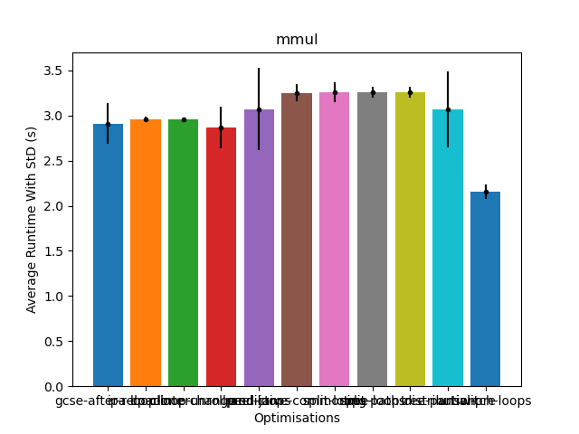
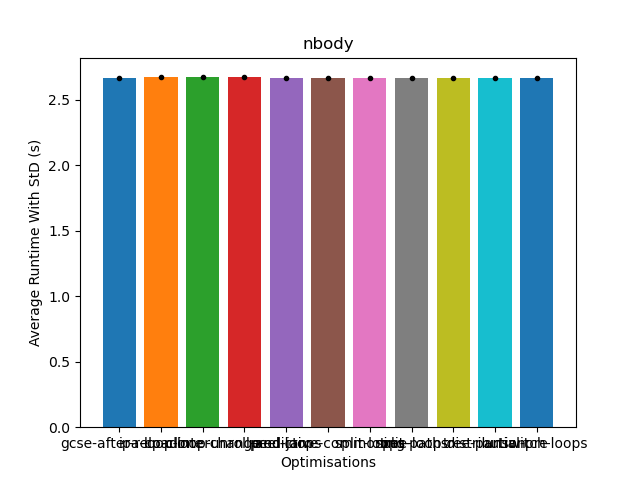
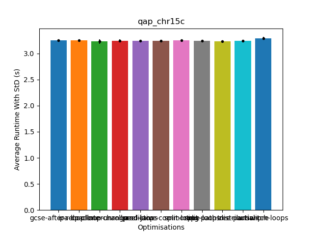
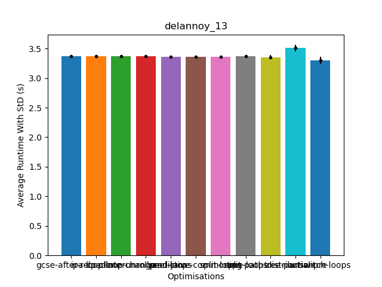
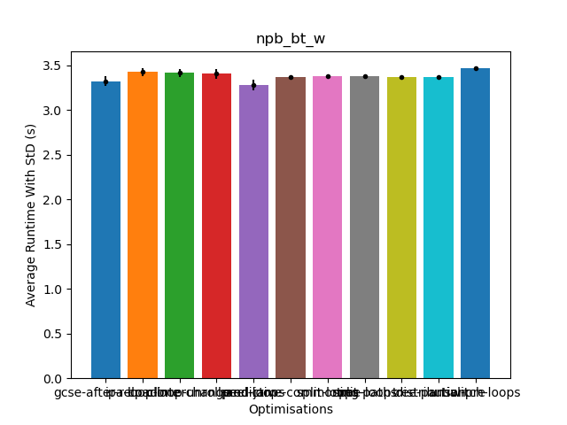
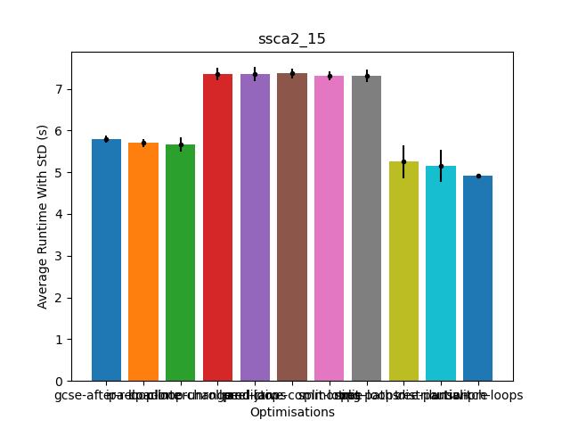
